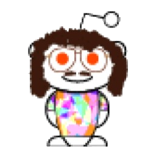

# Bobby the Wonder Bot

A custom Discord bot for the r/WeirdAl [subreddit][reddit] and [Discord server][discord]

[][discord]
[][reddit]

**Currently in early development. Stay tuned for further updates!**

## Features

Planned features include announcements, event management, messages responses,
and moderation. Please check out the [projects tab][project] for a full
overview of features, including their level of completion.

## License

Bobby the Wonder Bot is licensed under [ISC License](LICENSE.txt).

<!-- Links -->

[reddit]: https://www.reddit.com/r/weirdal/
[discord]: https://discord.gg/4wKTfG2
[support]: https://discord.gg/72qa2YJZxY
[project]: https://github.com/WeirdAlex03/Bobby-the-Wonder-Bot/projects/1
